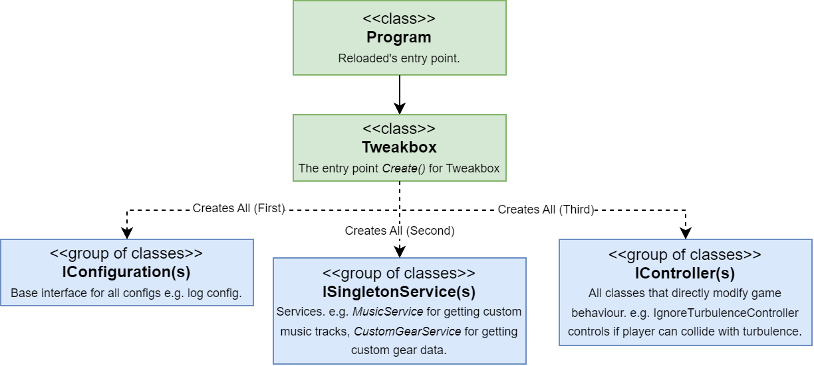

# Introduction

!!! info

    Provides an introduction to Tweakbox' internal code structure, including how things are laid out.  


## Initialization

!!! info

    Provides a simplified top level view of how initialization happens in Tweakbox.  



### Entry Point (Program)

The life of Tweakbox begins in `Program.StartEx()`, this method is responsible for the following:  
- Setting up 3rd party libraries (e.g. one time method calls).  
- Fetching Reloaded dependencies [e.g. [File Redirector](https://github.com/Reloaded-Project/reloaded.universal.redirector) to use with music].  
- Adjusting anything runtime related.  

Program then delegates to `Tweakbox`, which sets up Tweakbox' code.  

### Tweakbox Entry Point (Tweakbox)

The `Tweakbox` component is responsible for the following [in order]:  
- Sanity checks (e.g. ensure files don't use vanilla compression).  
- Setting up UI Menus.  
- Initialising all `IConfiguration`(s), `ISingletonService`(s) & `IController`(s) in this specific order.

## Components

!!! info

    Defines the common kinds/types of items you'll find in Tweakbox' source code.  

!!! note

    Unless stated otherwise, assume components are singletons, i.e. there is only ONE instance of each configuration in memory and it's reused everywhere.  

### Configs (IConfiguration)

!!! info

    Stores an individual configuration for a component or a set of Tweakbox components.  

Within Tweakbox' source, you will find two types of configurations, `Binary` and `JSON`. 

`JSON` configurations are used when all of the data is known, and inherit from `JsonConfigBase` which provides all of the backbone code for the configuration(s).  

Example:  
```csharp
// JsonConfigBase inherits from IConfiguration and provides all needed boilerplate code.
public class TextureInjectionConfig : JsonConfigBase<TextureInjectionConfig, TextureInjectionConfig.Internal> 
{
    public class Internal
    {
        public bool DumpTextures = false;
        public DumpingMode DumpingMode = DumpingMode.All;
        public int DeduplicationMaxFiles = 2;
    }

    public enum DumpingMode
    {
        All = 0,
        OnlyNew = 1,
        Deduplicate = 2,
    }
}
```

`Binary` configurations are typically used when the data:  
- Needs to be small.  
- Contains unknown values (e.g. Not fully reversed Sonic Riders' game structs).  

Example `Binary` configuration:  
```csharp
public unsafe class GearEditorConfig : IConfiguration
{
    private static GearEditorConfig _default = new GearEditorConfig();

    /// <summary>
    /// Extreme gears assigned to this config.
    /// </summary>
    public ExtremeGear[] Gears;

    /// <summary>
    /// Creates the default editor config.
    /// </summary>
    public GearEditorConfig()
    {
        Gears = new ExtremeGear[Player.OriginalNumberOfGears];
        Player.Gears.CopyTo(Gears, Gears.Length);
    }

    /// <summary>
    /// Creates a <see cref="GearEditorConfig"/> from the values present in game memory.
    /// </summary>
    public static GearEditorConfig FromGame() => new GearEditorConfig();

    /// <summary>
    /// Updates the game information with the gear data stored in the class.
    /// </summary>
    public unsafe void Apply() => Player.Gears.CopyFrom(Gears, Player.OriginalNumberOfGears);

    /// <inheritdoc />
    public Action ConfigUpdated { get; set; }
    public byte[] ToBytes() => LZ4.CompressLZ4Stream(StructArray.GetBytes(Gears), LZ4Level.L12_MAX);

    public void FromBytes(Span<byte> bytes)
    {
        var outputArray = new byte[StructArray.GetSize<ExtremeGear>(Player.OriginalNumberOfGears)];
        var decompressed = LZ4.DecompressLZ4Stream(outputArray, bytes, out int bytesRead);

        StructArray.FromArray(decompressed, out Gears, true, Player.OriginalNumberOfGears);
        ConfigUpdated?.Invoke();
    }

    public IConfiguration GetCurrent() => FromGame();
    public IConfiguration GetDefault() => _default;
}
```

[Stores the whole array of all extreme gear data in Riders]

### Services (ISingletonService)

!!! info

    Provides various utility functions to be used throughout Tweakbox.  
    Also a singleton.

Example API(s):  

```csharp
/// <summary>
/// Keeps track of all music tracks provided by other mods (as well as the vanilla game)
/// </summary>
public class MusicService
{
    /// <summary>
    /// Gets the name of a random alternative track for a given file name.
    /// </summary>
    /// <param name="fileName">The file name for which to get a replacement track.</param>
    /// <param name="includeVanilla">Whether to include vanilla tracks or not.</param>
    /// <param name="includePerStageTracks">Whether to include stage-specific tracks.</param>
    /// <returns>Path to the replacement track.</returns>
    public unsafe string GetRandomTrack(string fileName, bool includeVanilla, bool includePerStageTracks);

    /// <summary>
    /// Obtains all potential candidate tracks for a given stage.
    /// </summary>
    /// <param name="stageId">The stage index.</param>
    /// <param name="files">List of files to add the candidates to.</param>
    public void GetTracksForStage(int stageId, List<string> files);
}
```

```csharp
/// <summary>
/// Converts Sonic Riders' PVRT texture format to DDS using the game's built-in converter.
/// </summary>
public class PvrtConverterService : ISingletonService
{
    /// <summary>
    /// Converts a texture to DDS.
    /// </summary>
    /// <param name="pvrtData">The PVRT texture to convert.</param>
    /// <returns>DDS data generated from PVRT.</returns>
    public unsafe byte[] Convert(Span<byte> pvrtData);
}
```

### Controllers (IController)

!!! info 

    Controllers contain all the functionality that modifies directly how the game itself functions.  
    These controllers usually 'hook' into the game code, by either replacing the method or injecting some assembly code.  

Random Example(s):  

| Controller                   | Description                                                                   |
| ---------------------------- | ----------------------------------------------------------------------------- |
| MusicInjectionController     | Replaces the music track(s) that will be loaded by the game.                  |
| IgnoreTurbulenceController   | The 'C toggle' for ignoring turbulence if desired.                            |
| BorderlessWindowedController | Toggles the game's Borderless Windowed state during startup and in real time. |
| RailController               | Controls the speed of the Rails.                                              |
| AutoSectionController        | Automates Left+Right inputs during automated sections.                        |

Within controllers there exists one special case, `EventController`. This controller is implemented mainly in x86 assembly, split over multiple files and provides callbacks which you can subscribe to that modify various game behaviours.  

For example:  
```csharp
EventController.SetRingsOnHit += SetRingsOnHit;
private void SetRingsOnHit(Player* player) => player->Rings = 42;
```

### Menus (IComponent)

!!! info 

    Menus use the `IComponent` interface and are created + registered during Tweakbox startup. 

Random Example(s):  

| Controller       | Description                                 |
| ---------------- | ------------------------------------------- |
| AboutMenu        | Renders the about page.                     |
| TweakboxSettings | Renders the Tweakbox general settings menu. |
| SlipstreamDebug  | Shows slipstream data in real time.         |

#### Creating Menus

In practice, all menus inherit from `ComponentBase` or `ComponentBase<TConfig>`, which provide a default implementation of `IComponent`.  

Sample dummy menu (via `ComponentBase`): 
```csharp
// Renders 
public class DummyMenu : ComponentBase
{
    public override string Name { get; set; } = "Dummy Menu";
    public override void Render()
    {
        if (ImGui.Begin(Name, ref IsEnabled(), 0))
        {
            // Code to render menu here
            
        }

        ImGui.End();
    }
}
```

If you need to have a config for this menu, use `ComponentBase<TConfig>`. 

```csharp
// InfoEditorConfig is an IConfiguration
public class InfoEditor : ComponentBase<InfoEditorConfig>, IComponent
{
    public override string Name { get; set; } = "Info Editor";

    // Note the constructor, it passes some stuff to base class.
    public InfoEditor(IO io) : base(io, io.InfoConfigFolder, io.GetInfoConfigFiles, ".json") { }

    public override void Render()
    {
        if (ImGui.Begin(Name, ref IsEnabled(), 0))
        {
            // Provides the New/Delete/Load/Save part of the menu.
            ProfileSelector.Render();
            
            // Code to render menu here
        }

        ImGui.End();
    }
}
```

#### Registering Menus

!!! info

    Custom Menus must be registered in `Tweakbox.cs` to show in the overlay.  

Example:  
```csharp
new MenuBarItem("Main", new List<IComponent>()
{
    // Your custom menu here.
    Benchmark(() => IoC.GetSingleton<DummyMenu>(), nameof(DummyMenu)), 

    // Previously existing menus.
    Benchmark(() => IoC.GetSingleton<NetplayMenu>(), nameof(NetplayMenu)),
    Benchmark(() => IoC.GetSingleton<UserGuideWindow>(), nameof(UserGuideWindow)),
    Benchmark(() => IoC.GetSingleton<AboutMenu>(), nameof(AboutMenu)),
    Benchmark(() => IoC.GetSingleton<OpenSourceLibraries>(), nameof(OpenSourceLibraries)),
})
```

## Projects

!!! info

    Provides a listing of projects within the Tweakbox source code.  

| Project                          | Description                                                                                                                                        |
| -------------------------------- | -------------------------------------------------------------------------------------------------------------------------------------------------- |
| Riders.Netplay.Messages          | Contains all code responsible for writing/reading individual messages over the network.                                                            |
| Riders.Netplay.Messages.Tests    | Test code for messages library; can be barebones at times.                                                                                         |
| Riders.Tweakbox.API.SDK          | Code for communicating with the [Web Server providing server browser, ranking](https://github.com/Sewer56/Riders.Tweakbox.API).                    |
| Riders.Tweakbox                  | Main mod code.                                                                                                                                     |
| Riders.Tweakbox.CharacterPack.DX | Test/example mod for adding custom character behaviours. [Ports SRDX 1.0.1 char stats to Tweakbox]                                                 |
| Riders.Tweakbox.Gearpack         | Test/example mod for adding custom gear behaviours. [Ports all gears from all mods released before late 2021]                                      |
| Riders.Tweakbox.Interfaces       | API for other mods to use. [Recommend Reading: Dependency Injection in Reloaded-II](https://reloaded-project.github.io/Reloaded-II/DependencyInjection_HowItWork/) |
| Sewer56.Hooks.Utilities          | Helper code for manipulating game functions with x86 assembly.                                                                                     |
| Sewer56.Imgui                    | Helpers for creating menus. (Extensions for our *Dear ImGui* wrapper.)                                                                             |
| Sewer56.SonicRiders              | API and definitions for hacking Sonic Riders                                                                                                       |

[Some projects have been omitted to keep the list simpler.]