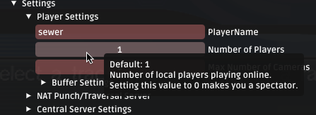
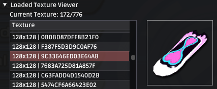
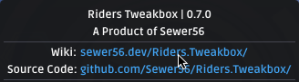

# Overlay Helpers

!!! info

    Provides a small listing of helpful classes that may be used for creating UI elements.  

## Controls

!!! info

    Contains all custom controls made for the Reloaded UI.

### Tooltips

!!! info "About"

    The `Tooltip` class can be used to display tooltips on individual UI elements. 



(Using `Tooltip.TextOnHover` to display tooltip on last rendered UI element)

### TextInputData

!!! info "About"

    Allocates memory to use in controls that allow the user to manipulate text.  

```csharp
var username = new TextInputData("", TextLength);

// Calling 'Render' will give you a textbox.
username.Render("Username");
```

The `Render` method is just for convenience since `TextBox` (InputText) is the most common control.  
You could use `username.Pointer` with other text based controls as needed.  

### ProfileSelector

!!! info "About"

    Standalone widget for loading configuration files.  


### Reflection

!!! info

    Wrapper over some parts of the original API for easier drawing of UI elements. Could maybe use better name.

```csharp
// Make a control to edit an integer with a parameter
Reflection.MakeControl(ref bufferSize, "Default Buffer Size");
```

This is defined as:  
```csharp
// Internal Definition
public static bool MakeControl(ref Int32 value, string name)
{
    return ImGui.DragScalar(name, (int)ImGuiDataType.ImGuiDataTypeS32, (IntPtr) Unsafe.AsPointer(ref value), 1.0F, IntPtr.Zero, IntPtr.Zero, null, 1);
}
```

### ImageRenderer

!!! info "About"

    You can use this to render native DirectX textures inside the UI.  

Example usage:  

```csharp
imageRenderer = new ImageRenderer();

// TextureOut is `LPDIRECT3DTEXTURE9 *ppTexture` as seen in e.g. `D3DXCreateTextureFrom` APIs.
var texturePtr = (IntPtr)(*currentImage.TextureOut);
var texture = new Texture(texturePtr);
var desc = texture.GetLevelDescription(0);
imageRenderer.SetImageSize(new Vector2(desc.Width, desc.Height));
imageRenderer.Render(texturePtr);
```



### Hyperlinks

!!! info "About"

    Clickable piece of text that opens a link or file.  

!!! todo

    Hyperlinks could be improved (change colour on hover, change mouse cursor) etc.

Use the `Hyperlink.CreateText` API.  



## Layout

!!! info

    Contains helper classes related to setting up the layout of the windows and/or contents.  

WIP

## Miscellaneous 

### Finalized<T>

!!! note

    This API will probably be removed.  

In the past [our Dear ImGui Wrapper](https://github.com/Sewer56/DearImguiSharp) which is made using [CppSharp](https://github.com/mono/CppSharp) didn't have finalizers, which meant not using a `using` statement or `Dispose()` may have led to memory leaks. This is no longer the case so this class no longer has any use.  