# Changelog

The format is based on [Keep a Changelog](https://keepachangelog.com/en/1.0.0/)
and this project adheres to [Semantic Versioning](https://semver.org/spec/v2.0.0.html).

## Release Description

This is a beta release.
It's huge, probably the biggest update since initial test builds but a beta version nonetheless.

Some of the features of this release are not fully tested; as I am unfortunately stressed, lacking in time and with real life things to sort out.

I'm willing to make some time to fix minor bugs but don't expect major development soon.

## Early Access Notice
Please note that this project is not yet ready for public consumption. 
Netplay still has flaws. Very minor issues, but flaws nonetheless. 
I do not yet consider this project to be of production quality. 

Please report any issues (especially crashes) using the guidelines provided in [Reporting Issues](https://sewer56.dev/Riders.Tweakbox/reporting-issues/).

*Do not* ask for Tech Support (e.g. *"How do I use this mod"*).

## Features

### Graphics Improvements

Tweakbox 0.5.0 comes with many improvements with regards to how graphics and rendering are handled within the game.  

To name a few changes:

- You can now change resolution in real time.  
- You can now go to full-screen without restarting the game.  
- The game can now instantly be minimized and maximized from/to full-screen.  
- The graphics menu has been simplified and made easier to use.  
- The game window no longer resets itself to the corner after a User Account Control (UAC) prompt is shown.  
- The game now fully supports Direct3D9Ex; and all its benefits.  

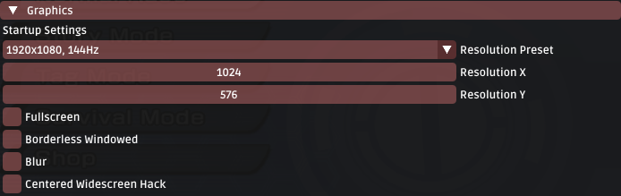  

### Breaking Limits

Version 0.5.0 extends many of the built-in game limits to better accomodate modern hardware and mods of the future.

Examples include:

- The game can now load up to 768MB of assets at any given time. (from 50MB)*  
- The game can now execute 40960 tasks (objects, effects etc.) in total. (from 1024)  
- Stages can now have a maximum of 8192 collision objects. (from 600)  

\* This limit is further extended to 2GB is a patch known as 'Large Address Aware' is applied to the game's exe file. In 0.5.0, this limit was set at startup. In 0.5.4+, this limit is configurable and accessible via `Tweakbox Settings -> Startup`.

### Discord Rich Presence Support

Tweakbox now ships with complete Discord information; including reporting both information about your current game status and your Netplay Session.

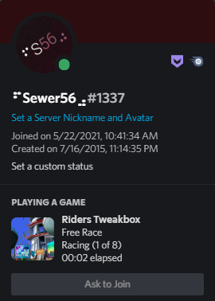  

And of course, Discord invites are supported too:

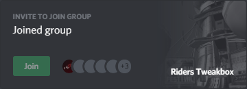

### Server Browser

You can now more easily find games hosted by other people by using the built-in server browser.

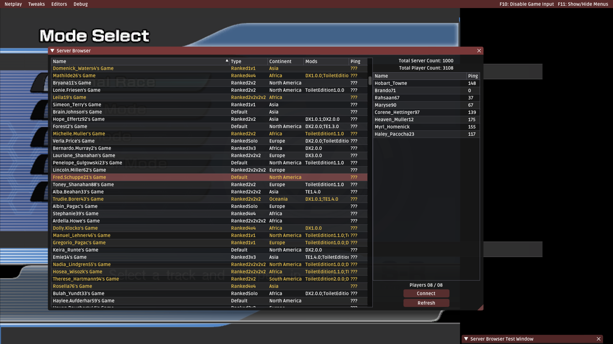

(This is just some test data)

The Server Browser is powered by a home made, [in house built web server](https://github.com/Sewer56/Riders.Tweakbox.API) which was made *specifically for Riders.Tweakbox*. There will be more features in the future such as *Ranked Play*, *Elo-like Match Making Rating* and *Statistics Tracking*. **Those are already implemented server side.**

### Netplay Modifiers

Support for various "Modifiers", or ways in which you can customize your own Netplay lobby have been added. For now, the features are limited but extended features will come in the future.

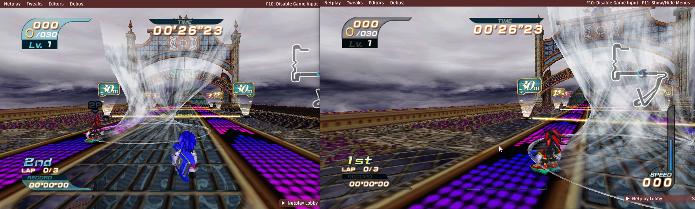

Turbulence everywhere... even in running mode.

### Music Injection

Tweakbox now allows you to add custom ADX music to the game by creating external Reloaded-II mods.  
This allows you to provide alternative tracks to the game's default soundtrack.

When the game is about to play a music track, Tweakbox will randomly choose from one of your own music tracks.

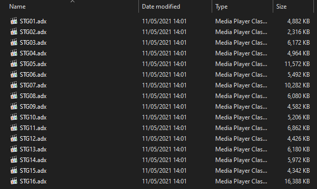

Tweakbox allows you to replace music using two modes:

- Per Stage  
- Per File  

The example above shows per-stage music injection.

There is no limit to this feature. If you want 20GB worth of 4000 music tracks or 500 music tracks for a single stage, be my guest.  
For more details, refer to Tweakbox' documentation.

### Texture Injection

Tweakbox now allows you to replace textures in real-time by hijacking function calls to the Direct3D 9 API.  
Similar to how Dolphin Emulator handles it, you can inject textures without the need to modify game files.

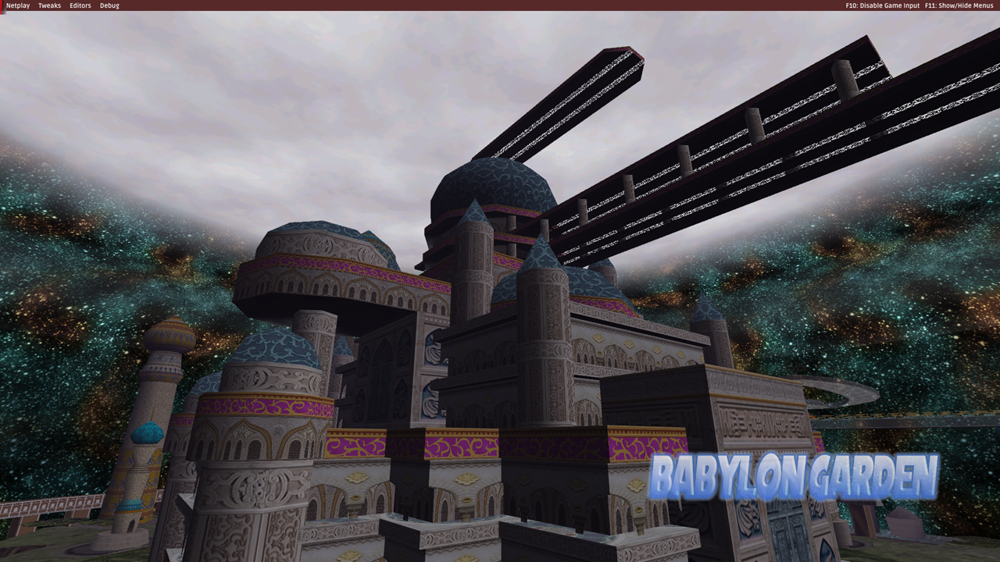

Textures are supported in the following formats:

- PNG  
- DDS  
- DDS.LZ4 (Custom)  

Creation of texture packs is easy, with a step by step guide available in the documentation.

### Animated Texture Injection

If you desire a bit more style, and wish to flex on the people emulating the GameCube version of the game, Tweakbox allows you to add basic animation to any texture:

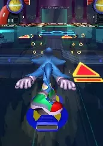

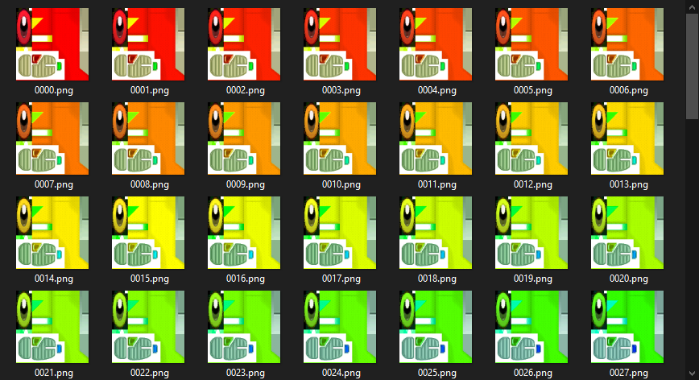

For more details, refer to Tweakbox' documentation.

### Texture Dumping

You can also dump textures from the game as they are loaded in real-time.

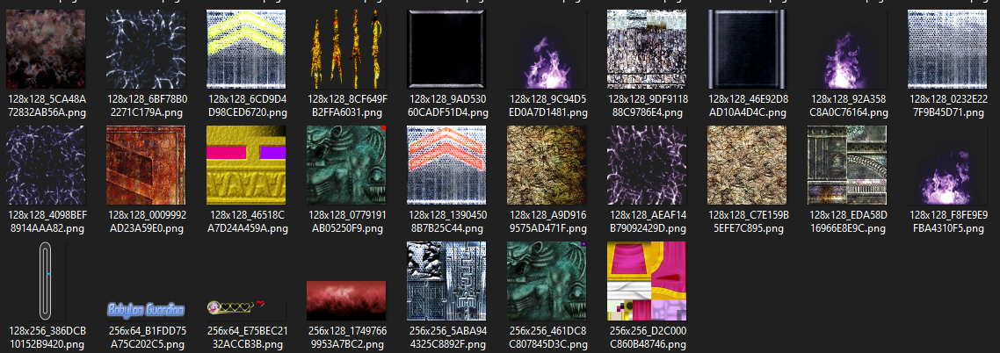

The texture dump tool comes with multiple modes; such as:

- `Only New` mode which doesn't dump textures already dumped.
- `Deduplication` mode, which puts textures with more than X duplicates in a `Common` folder.

Chances are that you wouldn't need to texture dump yourself though; as I've gone through the effort of dumping **3000+ textures** on my own, with perfect dumps for every single stage.

With the improved texture dumping tools and some clever usage of them, the texture archive I made in the span of a day is more complete and accurate than what's been available for the GameCube version over the last 2 years.

[Here's a link to my texture archive, it contains ~99% of all of the game's textures](https://drive.google.com/drive/folders/17ZLnShFn7p20Pv7D0HfGdEi58hgkFjyO).

### Texture Cache

Starting with 0.5.5+ Tweakbox also maintains a built-in texture cache to work around slow loading times of PNG textures. 

When a PNG is loaded for the first time and its mipmaps are generated, the texture will be converted to the optimal `DDS.LZ4` custom format for future use. Subsequent uses of the texture will instead load from the cache which is many magnitudes faster. The conversion happens in the background and is multithreaded, so you should not notice a difference in first time load performance compared to previously loading a PNG (< 0.5.5).

Editing the original PNG image will cause the cached texture for that file to be invalidated, and a new `DDS.LZ4` will be automatically created. Please note that the underlying cached DDS is uncompresed and eats memory for breakfast. Consider manually creating DDSes with DXT1 / DXT5 if you are working with e.g. Animated Textures. More info in the documentation.

### Object Layout Editor

Tweakbox now has a built-in, fully featured object layout editor; allowing you to:

- Add objects  
- Remove objects  
- Transform objects (scale, rotate, move)  
- Change object properties.  
- Save & Load Object Layouts.    
- Export object layout to GameCube/PS2/Xbox/PC.  
... and much more

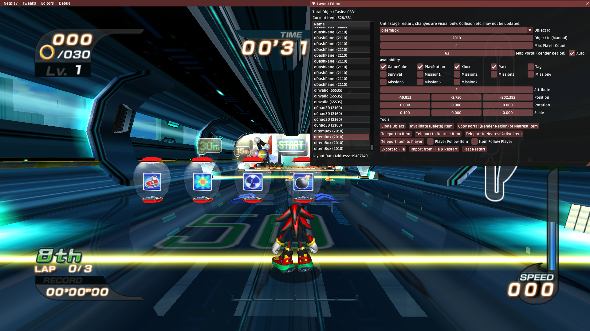

Oh, by the way, these itemboxes (and some others) are unused in the final game, hehehe.  
If you would like additional features, such as racing online with custom layouts, let me know.

*By the way... you can also now play Battle Mode in regular race stages hehehe...*

### End of Race Synchronization & Pause Menu

The players now have their own individual pause menus, allowing you to restart and exit the race (if host) or disconnect from the current lobby.

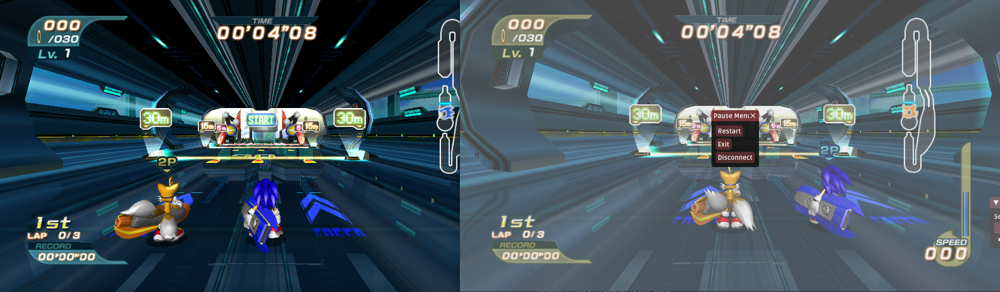

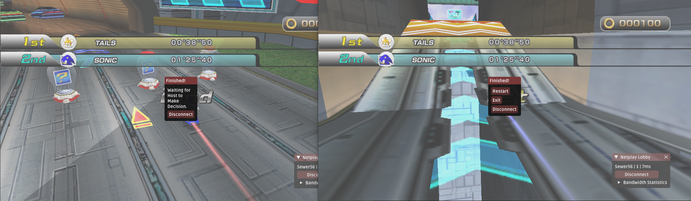  

The pause menu after the results screen has also been replaced with a custom menu allowing the host to choose what to do next.

### Version & Other Sanity Checks

In Netplay, Tweakbox will now make basic sanity checks such as:

- Ensuring that all clients are running the same version of Tweakbox.  
- Ensuring all clients are using the same Tweakbox extensions/plugins.  
- Ensuring all clients are running the same game mode.  

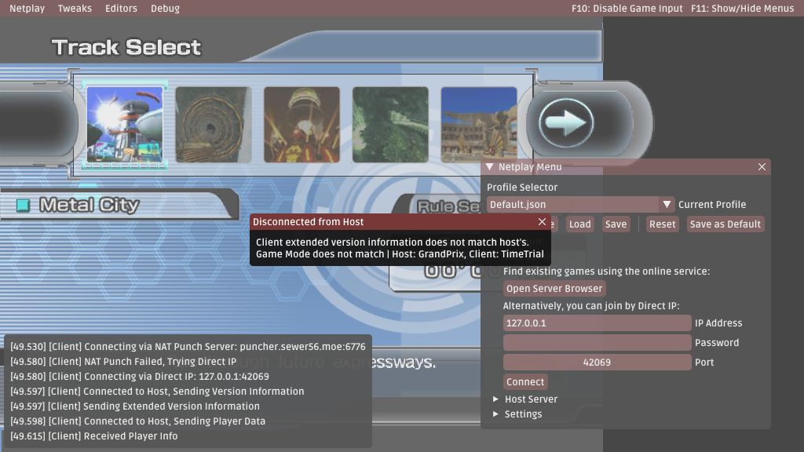

### Turbulence Editing

Tweakbox now allows you to edit turbulence physics and speeds. *For every single variation of Turbulence used by the game*.

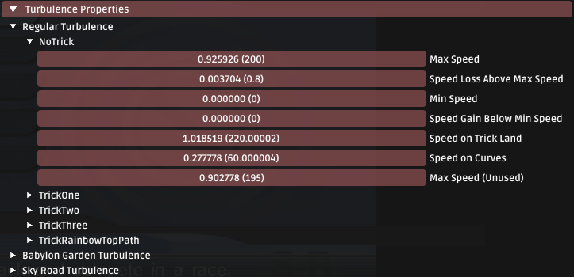

Of course, as with all features listed above and below, it syncs with host over Netplay.

### Object Behaviour Changing

Tweakbox can now change the behaviour of some common objects in the game; for example:

- Making dash panels give you additional speed to your current speed.  
- Making dash panels multiply your current speed.  
- Making dash panels give you a minimum amount of speed.  

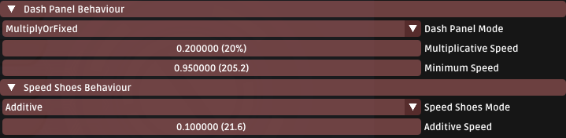

### Custom Deceleration Behaviour

Tweakbox can now change how the game handles deceleration; overriding the game's built in exponential deceleration with alternative options.

One of the options is `Linear` deceleration; which makes you decelerate at a constant rate regardless of how far above top speed you are.

You can now spam your "JCBCDPC"dsdasdasfdsjdfuisdfhsid(s). 

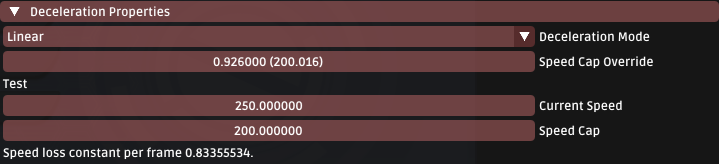

*The numbers in this screenshot are actually what Sonic Riders DX and Sonic Riders TE 1.3 use.*

### Boot to Stage

The mod now allows you to boot directly into a race (no menu navigation required) with a specific stage, character and gear combination. This is incredibly useful when testing mods.

### Return to Track Select

The mod now allows you to return directly into the track select menu after returning from a race.
This works with all game modes, unlike the implementations in the current popular GameCube version mods.

## Changes

- Changed: Connecting to a game does not freeze the game window until a connection is established.  
- Renamed: `Various Tweaks` to `Tweakbox Settings`.  
- Updated: Readme & Documentation Pages for all new and existing features.  
- Updated: Libraries used behind the hood.  
- Minor Performance Optimisations  

... and more

## Fixes

- Fixed: Having the same submenu open in the gear editor for multiple gears at once causes you to only be able to interact with the first one.  
- Fixed: Memory Leak in Boot To Menu   

... and more

