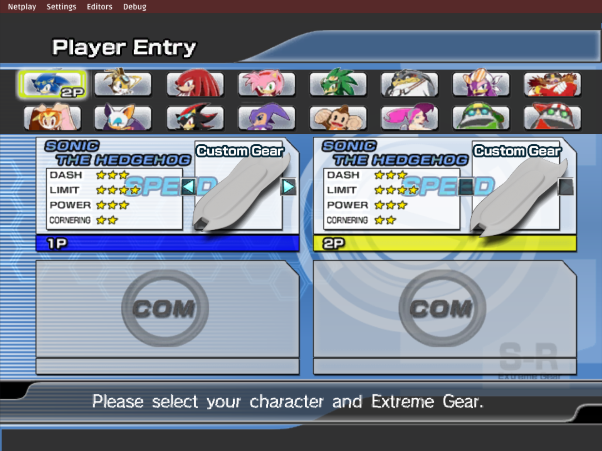
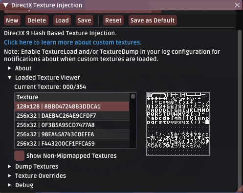
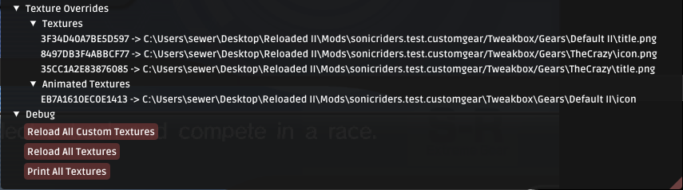
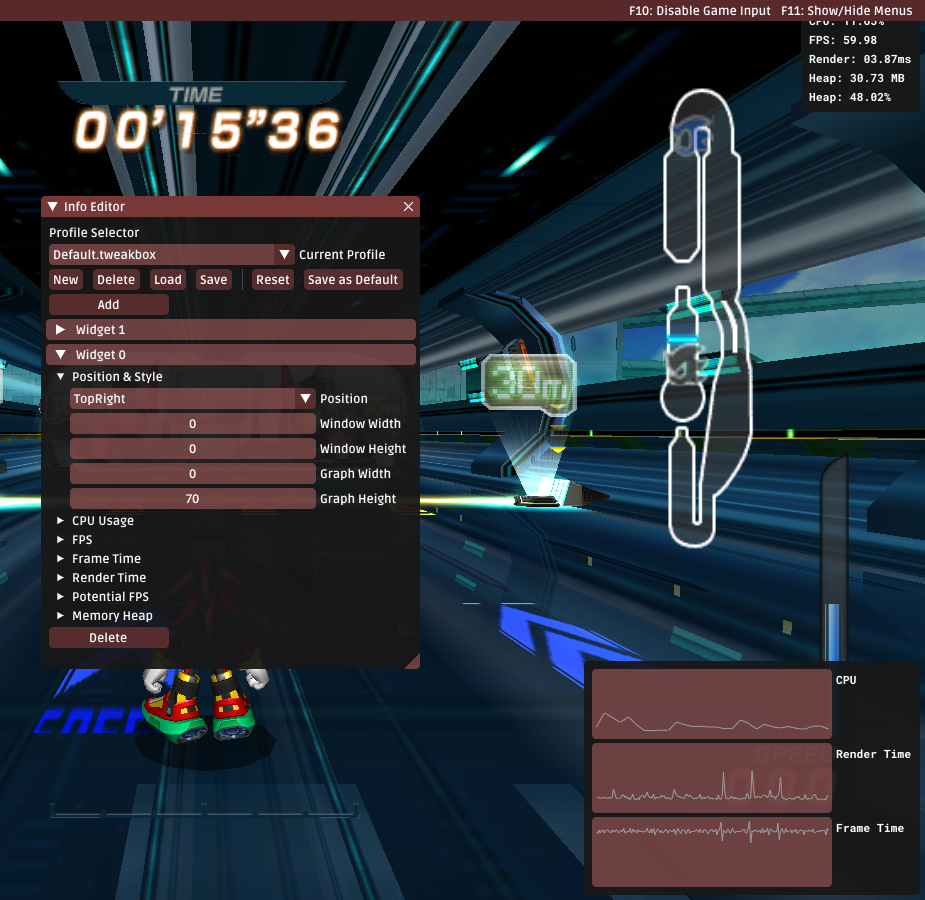
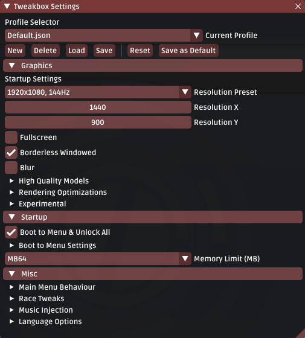
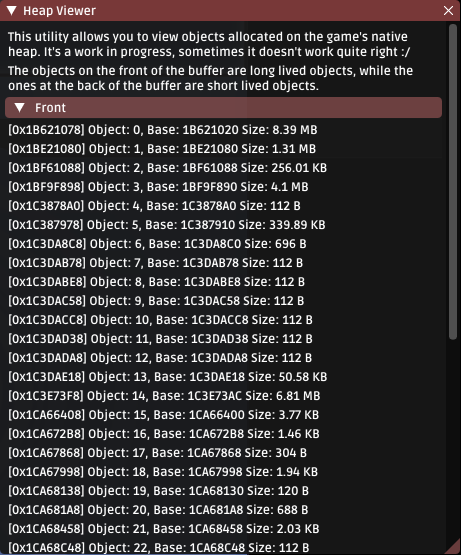
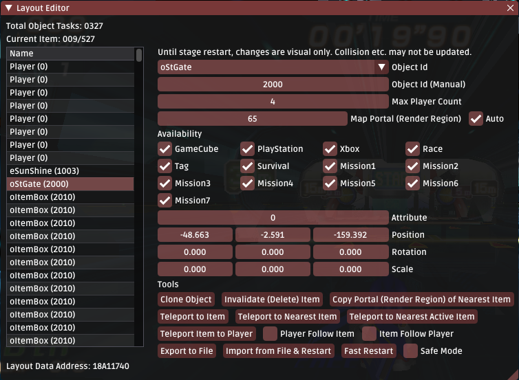

# Changelog

The format is based on [Keep a Changelog](https://keepachangelog.com/en/1.0.0/)
and this project adheres to [Semantic Versioning](https://semver.org/spec/v2.0.0.html).

This document lists all changes 

## Release Description (0.6.0)

This is a beta release.

This release mostly consists of additional polish in existing features, albeit there are some new toys to play with (one of them is really impressive!).

Most of the features in this release have been tested, though there may be some odd things here and there around the edges; as I've still other things to do outside of Riders.

Please report bugs (no matter how minor); I'll do what I can to test them in a timely manner.

## Early Access Notice
Please note that this project is not yet ready for public consumption. 
Netplay still has flaws. Very minor issues, but flaws nonetheless. 
I do not yet consider this project to be of production quality. 

Please report any issues (especially crashes) using the guidelines provided in [Reporting Issues](https://sewer56.dev/Riders.Tweakbox/reporting-issues/).

*Do not* ask for Tech Support (e.g. *"How do I use this mod"*).

## Features

### Custom Gear Support

The staple feature of this patch.

Tweakbox now supports the addition of fully custom gears; that is, having customized gears without having to replace the vanilla gears. 

Here's some details:

- Custom gears can be normally selected from Character Select; no magic buttons required.
- You can have up to 214 custom gears (255 gears total).
- Custom gears are Supported in Netplay (requires more testing).
- Custom gears can have custom icons and names in Character Select. 
- Custom gears can be edited from within the built-in gear editor.
- You can export any gear from Gear Editor into a brand new custom gear.

What's left?
- Custom model support for custom gears. (Will implement on demand)

### Enhanced Texture Tools

Some minor improvements have been made to existing texture injection tools used in Riders; for example the introduction of the texture viewer tool.

The texture viewer allows you to preview all currently loaded textures in real time; which makes the creation of texture packs or finding hashes for your custom textures more convenient.

Oh, by the way, this is the debug menu font! It's not there in the console releases <3.

It's also now possible reload textures in real time; allowing for changes to be seen without having to re-load the menu/stage; as well as see a list of all texture redirections that have been made. Useful stuff!

### Widget Support

Tweakbox now has the ability to display various widgets on the screen.

Widgets can be pinned to any edge or corner of the screen and display information such as, FPS, Frame Time, CPU and Memory Usage to the screen.

The user can add or remove as many widgets as they like.

### Cleaned Up Settings Menu

The layout of the settings menu has been cleaned up for better organization and accessibility. Related settings are now grouped together under expandable trees.

### Forced Netplay Settings

Version 0.6.0 adds a feature which forces certain settings to be enabled while in Netplay mode:

- Enable return to Stage Select from Race/Survival/Tag
- Enable driving backwards.
- Enable FPS cap.

These features cannot be toggled while participating in Netplay; and are enabled to ensure consistency between all players.

### Improved Logging Efficiency

Starting with version 0.6.0, Tweakbox uses an upcoming C# 10 feature called [Improved Interpolated Strings](https://github.com/dotnet/csharplang/blob/main/proposals/csharp-10.0/improved-interpolated-strings.md) which allows for more efficient logging. 

Notably, if the log level/category for a specific message is not enabled, the string will not even be constructed at all; saving both time and unnecessary memory allocations without the need of writing repetive, redundant ugly checks on every log operation. 

### Heap Allocation Viewer

Starting with version 0.6.0, there's a cool little utility for tracking allocations made to the game's native heap.

This is a result of my study into how the game handles memory allocations.

Sometimes it doesn't seem to work perfectly yet for the `Front` side (if there's an issue, you'll experience game lag); as the front side of the heap wasn't really designed to be walked through, and game doesn't clean up properly sometimes. Most of the time however it works perfectly fine.

The back side works perfectly without issue.

### Improved Loading Times

Starting with version 0.6.0, race loading times have been improved by up to 60%.
Previously loading an 8 player race has taken around 2.5 seconds, now it takes 1.5 seconds.

### Improved Startup Times

Tweakbox now obsoletes a third party file caching mechanism from CRI Middleware originally used in Riders. This improves the initial cold boot startup time by around 10 seconds.

Note: `"Cold Booting"` refers to running the game after a PC restart or after some time has passed since last launch.

### Animated Texture Improvements
There's a collection of minor improvements related to animated textures:

- Texture Cache: Animated textures are now automatically packed into a single archive to improve performance.

 The archive consists of a list of raw DDS files compressed using lz4.
 This significantly improves load times when many frames are used.

- Animated textures will now load in the background without stalling the game startup process.

The game will now use the first frame of the animated texture until loading of the remaining frames is ready.
This prevents stutters on loading animated textures outside of load screens (e.g. Character Select).

- Tweakbox will now warn when high frame count animated textures are using an unoptimal format.

### Layout Editor Improvements

The in-mod layout editor has received some minor improvements:

- **Safe Mode:** Prevents updating object data in real time to ensure moving some objects (e.g. Rings) does not lead to crashes.

- **Autosave:** The layout editor will now create an automatic save of the at regular time intervals. Useful in case you encounter a crash.

### In-Game Language Change

The language of both the game's text and voice can now be changed on the fly.
Some changes (e.g. menu voices) are applied in real time, however others (e.g. localized menu assets) only apply after the next loading screen. 

### Improved Tweakbox Startup Times

Startup time of Tweakbox itself has been improved in verison 0.6.0, by approximately 75%. Startup now takes 0.7 seconds, instead of 1.2 seconds.

### Missing Model Fallback

When a model for a specific gear is missing (e.g. Sonic + Riders DX Advantage F); Tweakbox will now default to loading the default gear model for that gear type.

i.e. For boards it will load `Default Gear`, for skates it will load `Darkness` and for bikes it will load `E-Rider`.

This should prevent Tweakbox from crashing when from gear data from the GameCube mods are imported to Tweakbox. (Since those have custom model archives.)

### Miscellaneous

- Added: About Screen
- Added: Toggle FPS Cap.
- C#10 Features (Logging Improvements, File Scoped Namespaces)
- Fixed: Workaround for CPU Usage monitoring not working for some users.
- Fixed: Bad link in GitHub repository for documentation.
- Fixed: Bug causing the last frame of an animated texture to be skipped.
- Added: Tweakbox will now report unhandled errors/exceptions in the log.
- Changed: Do not fast forward if game resets frame counter (e.g. after load screens).
- Improved: Texture decompression performance (by a tiny amount).
- Changed: Made frame pacing more aggressive (slightly increased CPU usage for better pacing).
- Changed: Made process high priority for frame pacing reasons.