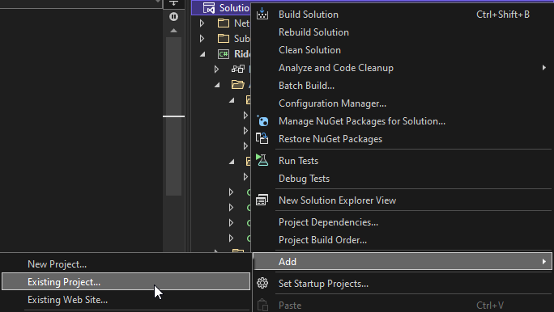
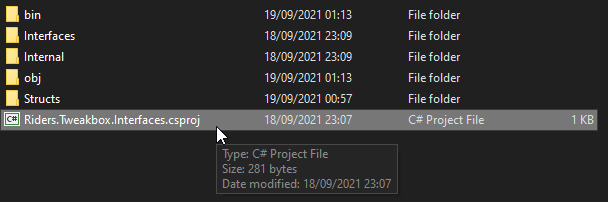
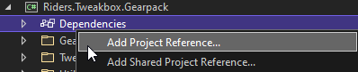
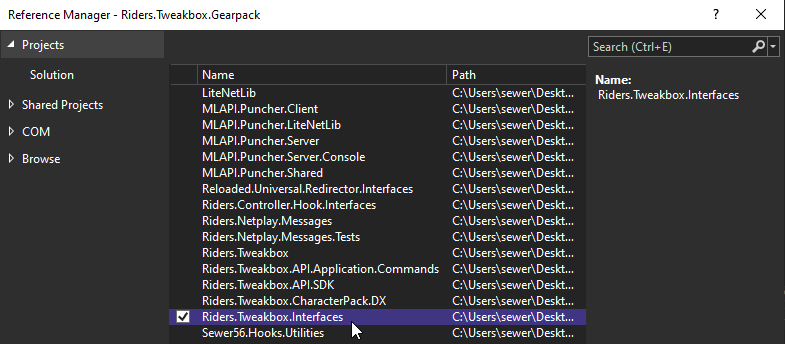
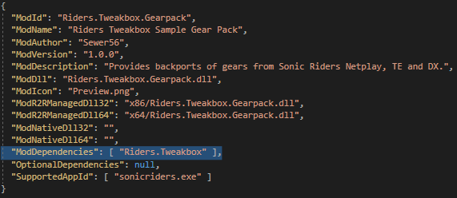

# Tweakbox API

Starting with version 0.7.0, Tweakbox offers a built-in API which allows you to control Tweakbox functionality as well as perform certain other operations which affect the state of the game.

## Getting Started

Setup usually takes around 2 minutes if you know what you're doing. If you're new to programming however, it might take you a while, be patient!

### Create a Reloaded-II Mod.

[Refer to the Reloaded-II wiki ("Building Mods") for guidance.](https://reloaded-project.github.io/Reloaded-II/DeveloperModGuide/)

### Clone this repository.

```
git clone --recursive https://github.com/Sewer56/Riders.Tweakbox.git
```

or add as git submodule

```
git submodule add https://github.com/Sewer56/Riders.Tweakbox.git
git submodule update --init --recursive
```

### Add Riders.Tweakbox.Interfaces to your project.

First add it to your solution by right clicking it.


and find `Riders.Tweakbox.Interfaces.csproj`


Then, add it as a project dependency to your Reloaded-II mod.




### Add Riders.Tweakbox as a Reloaded II dependency.

Edit your project's `ModConfig.json` to include `Riders.Tweakbox` as part of the `ModDependencies`.



### Consume the Tweakbox API

In your `Start` function of the mod, grab an interface to the R-II.

```csharp
// Get the API Controller
_modLoader.GetController<ITweakboxApi>().TryGetTarget(out var apiAccessor);

// Register to the tweakbox API
var api = apiAccessor.Register($"{config.ModId}.{config.ModVersion}");

// Use the API
var gearApi = api.GetCustomGearApi();
gearApi.RemoveVanillaGears();
```

### More Information

[Reloaded-II Documentation on Controllers](https://reloaded-project.github.io/Reloaded-II/InterModCommunication/)

## Example Usage

For more examples, consider looking at the example `Riders.Tweakbox.Gearpack` and `Riders.Tweakbox.CharacterPack.DX` projects contained in this repository. 

### Get Updated Pointers

Tweakbox rewrites some game code to make features such as custom gears possible. Therefore, some fields in libraries such as `Sewer56.SonicRiders` will need to be updated.

To obtain the updated pointers, use the `GetPointers` method.

```csharp
// Update Gear Data Pointer
var pointers = modImpl.GetPointers();
Sewer56.SonicRiders.API.Player.Gears = new FixedArrayPtr<ExtremeGear>((ulong)pointers.Gears.Address, pointers.Gears.NumItems);
```

### Add a Custom Gear to the Game

```csharp
// ICustomGearApi obtained via api.GetCustomGearApi();
public class BlueStarIIDX : CustomGearBase, IExtremeGear
{
    private BoostProperties _boostProperties = new BoostProperties()
    {
        AddedBoostChainMultiplier = 0.15f,
        AddedBoostDurationLv3 = 30
    };

    /// <summary>
    /// Initializes this custom gear.
    /// </summary>
    public override void Initialize(string gearsFolder, ICustomGearApi gearApi)
    {
        // Import a custom gear exported from the built-in `Export Custom Gear`
        // function in the gear editor.
        var data = gearApi.ImportFromFolder(Path.Combine(gearsFolder, "BlueStarII DX"));
        
        // Attach a class that overrides gear behaviours (via IExtremeGear)
        data.Behaviour = this;

        // Add the custom gear to the game!
        gearApi.AddGear(data);
    }

    // IExtremeGear API Callback
    public BoostProperties GetBoostProperties() => _boostProperties;
}
```

If you need to get the location of your mod's folder...

```csharp
// In your mod's `Start` method.
_modLoader.GetDirectoryForModId(MyModId)
```

### Modify Character Behaviour (Simple)

```csharp
public class Sonic : LateBoosterCharacter, ICustomStats
{
    private BoostProperties _boostProperties = new BoostProperties()
    {
        AddedBoostDurationLv2 = 60,
        AddedBoostDurationLv3 = 60,
    };

    /// <summary>
    /// Initializes this custom character.
    /// </summary>
    public void Initialize(Interfaces.ICustomCharacterApi characterApi)
    {
        Request = new ModifyCharacterRequest()
        {
            Behaviour = this, // Modifies the character behaviour.
            CharacterId = (int) Characters.Sonic, // Character Index. See Sewer56.SonicRiders.Structures.Enums.Characters
            CharacterName = "Sonic DX",
            Stack = false                  // Does not combine with other mods.
        };

        // Modify your character!
        characterApi.AddCharacterBehaviour(Request);
    }

    // Overrides for ICustomCharacter interface.
    public ApiCharacterParameters GetCharacterParameters() => new ApiCharacterParameters()
    {
        SpeedMultiplierOffset = 0f
    };

    public BoostProperties GetBoostProperties() => _boostProperties;
}
```

Usage:
```csharp
// Get API
var characterApi = api.GetCustomCharacterApi();

// Add character
var sonic = new Sonic();
sonic.Initialize(characterApi);
```

### Modify Character Behaviour (Clean)

Here's an example of how you could implement character 'archetypes'/'classes' (categories) for a cleaner approach. 

Base Character Class:
```csharp
public abstract class CustomCharacterBase : ICustomCharacter
{
    public ModifyCharacterRequest Request { get; private set; }
    public abstract string Name { get; }
    public abstract Characters Character { get; }

    /// <summary>
    /// Initializes this custom character.
    /// </summary>
    public void Initialize(Interfaces.ICustomCharacterApi characterApi)
    {
        Request = new ModifyCharacterRequest()
        {
            Behaviour = this,              // Modifies the character behaviour.
            CharacterId = (int) Character, // Character Index. See Sewer56.SonicRiders.Structures.Enums.Characters
            CharacterName = Name,
            Stack = false                  // Does not combine with other mods.
        };

        // Modify your character!
        characterApi.AddCharacterBehaviour(Request);
    }
}
```

Define the character class:
```csharp
// An implementation of Sonic Riders DX 1.0.0 Late Booster Character
public abstract class LateBoosterCharacter : CustomCharacterBase, ICustomCharacter
{
    // These are all callbacks for the ICustomCharacter interface.
    private BoostProperties _boostProperties = new BoostProperties()
    {
        AddedBoostDurationLv2 = 60,
        AddedBoostDurationLv3 = 60,
    };

    public ApiCharacterParameters GetCharacterParameters() => new ApiCharacterParameters()
    {
        SpeedMultiplierOffset = 0f
    };

    public BoostProperties GetBoostProperties() => _boostProperties;
}
```

Give the character that class (via inheritance):
```csharp
public class Sonic : LateBoosterCharacter, ICustomStats
{
    public override string Name { get; } = "Sonic DX";
    public override Characters Character { get; } = Characters.Sonic;
}
```