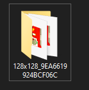
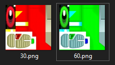
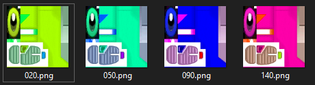
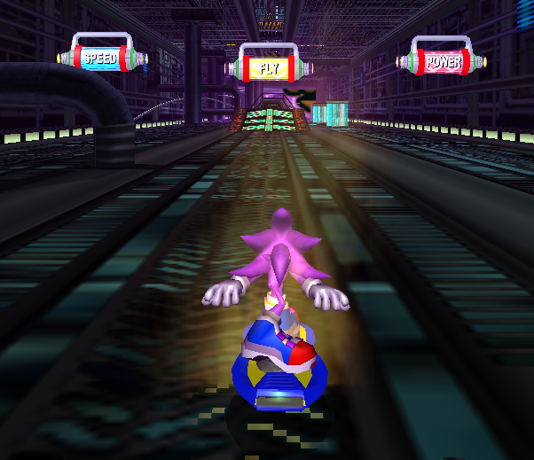

# Animated Textures

Riders.Tweakbox provides basic support for animated textures.

In order to make an animated texture, you should create a folder with the name of the texture; and inside that folder, make files with file names corresponding to individual keyframes of the animation.

The built-in texture animator will play back your animation, starting with the last frame of animation. As Riders runs at *60 frames per second*, a file with the name of `060`, will run on the 60th frame.

Tip: When dealing with many textures, a tool like [Bulk Rename Utility](https://www.bulkrenameutility.co.uk) might come in handy.

## Warning
*It is recommended to use this feature sparringly.*

High framerate animated textures are expensive on video memory, especially when paired with high resolutions. Going too far might make it hard for people with integrated graphics to run your mod. 

[**PLEASE OPTIMISE YOUR ANIMATED TEXTURES**](./optimizing-textures.md)
The examples here use PNGs for clarity; when you release your textures, you should use native DDS files.

## Basic Example

Alternate between two colours using a specified time interval.

In this scenario, the green texture for 30 frames (0.5 seconds) before switching to the red texture. After another 30 frames, you will go back to the green texture.

## More Colours

- The pink texture will show for 20 frames.
- Then the green will show for 30 frames.
- Then the light blue w ill show for 40 frames.
- Then the blue will show for 50 frames.
*repeat*

## Full Animation

Create Hyper Sonic by changing Super Sonic's texture every frame.

[Frame 74 of the Animation]

