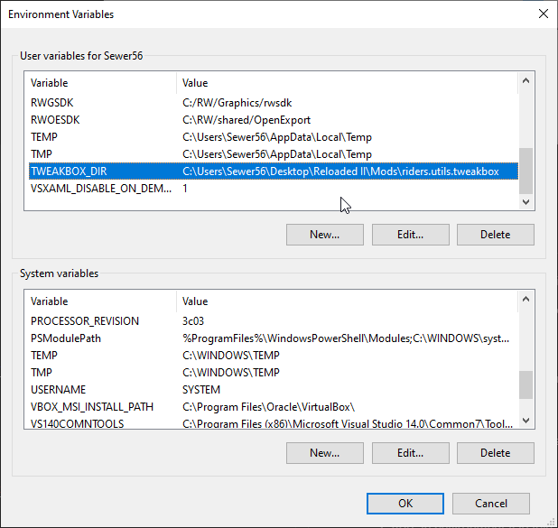

# Building

This is a summary. For additional guidance, please refer to the [Reloaded-II](https://reloaded-project.github.io/Reloaded-II/) documentation.

To build the mod, you will require the following components:

- Git
- [.NET 6 SDK](https://dotnet.microsoft.com/download/visual-studio-sdks)
- Visual Studio 2022

## Steps 

- Clone this repository (and its submodules).
```
git clone --recursive https://github.com/Sewer56/Riders.Tweakbox.git
```

- Add an environment variable named `RELOADEDIIMODS`.



The value should be the of the `Mods` folder in your Reloaded folder.

- Open `Riders.Tweakbox.sln` in Visual Studio or your preferred editing environment of choice.

# Publishing

Publishing builds this mod in an optimized format such that it is ready for end users to consume.

1. Open a PowerShell prompt and navigate to the `Riders.Tweakbox` folder.

2. Run the Publish script with `.\Publish.ps1`. 

3. This will automatically build the mod, make a folder called `Publish` and put a zipped compiled version of the mod there ready to be shared.