# Adding Gears

Tweakbox allows you to add **custom gears** to the game, expanding the vanilla game's total gear selection up to 255 gears.

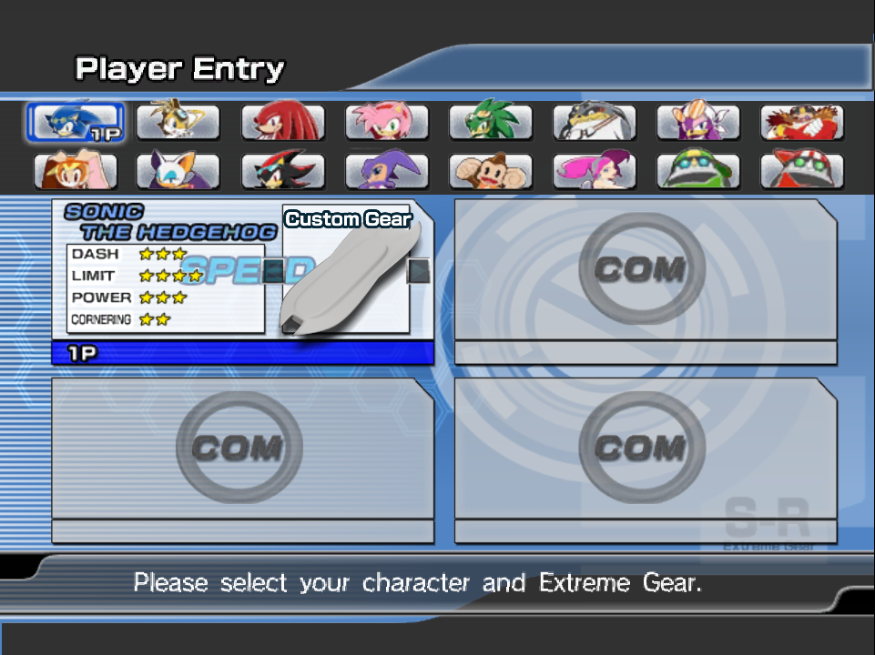

Each custom gear can have its own icon, title and name and be selectable by any of the characters involved.

## Getting Started

You can add additional gears by creating Reloaded II mods.

This is a short summary of how to create a mod; for a more in-depth guide on creating mods, please refer to the [Reloaded-II documentation](https://reloaded-project.github.io/Reloaded-II/GettingStartedMods/).

### 1. Make a new Mod

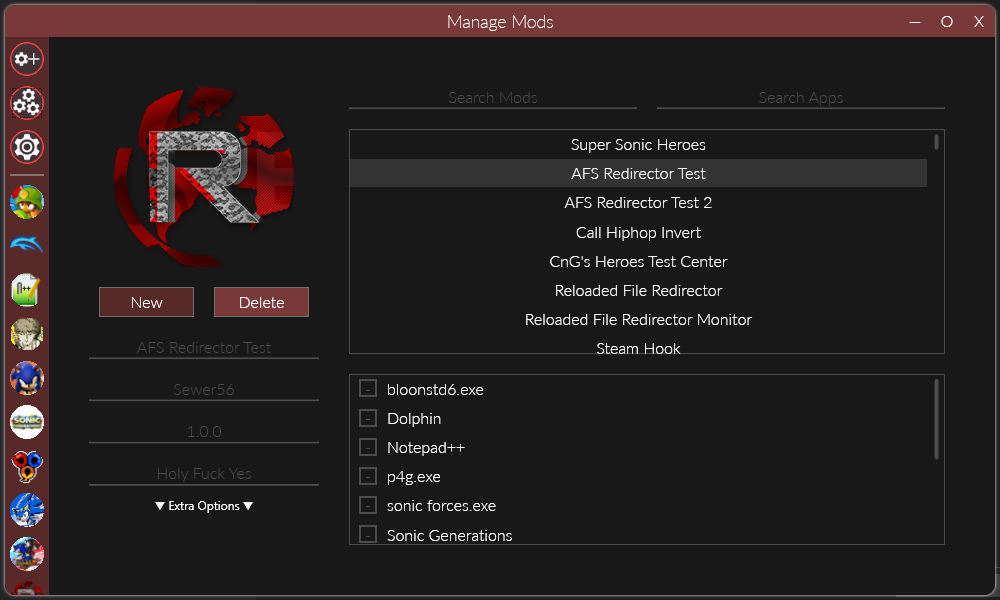

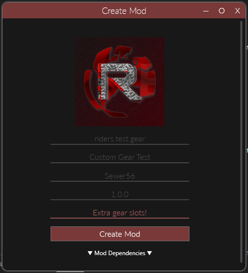

### 2. Enable it for Sonic Riders

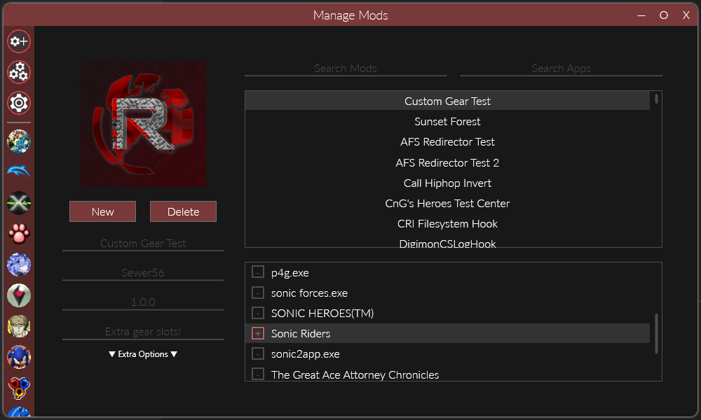

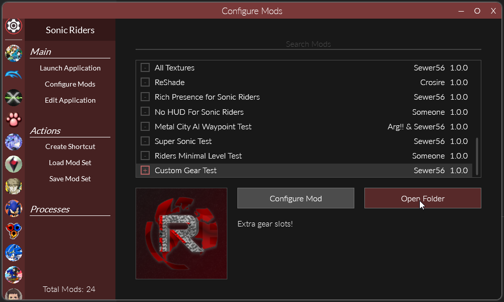

And go to your mod directory.

### 3. Create the Gear Directory

Inside mod directory, create a folder called `Tweakbox` and inside it, a folder called `Gears`.

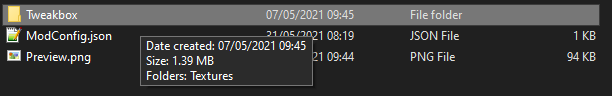

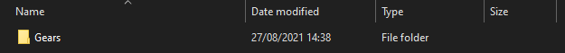

### 4. Create the Gear

Inside Tweakbox, go to the `Gear Editor`, make desired changes to your gear and select `Export as Custom Gear`.

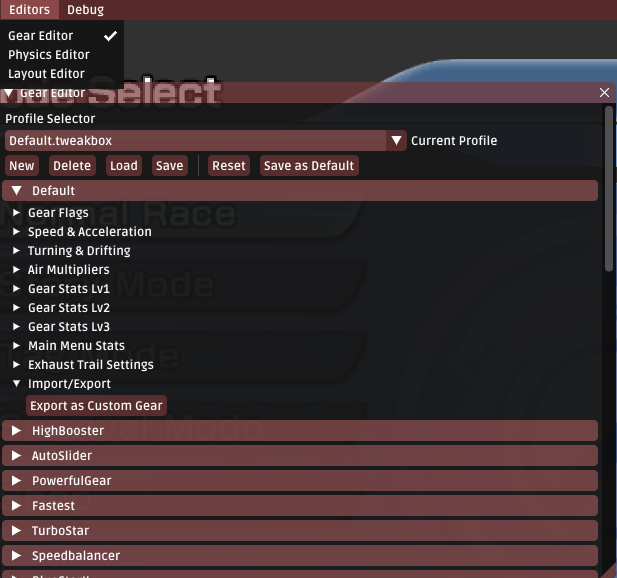

### 5. Copy the Gear

Tweakbox should open a folder in `Windows Explorer`.
Copy this folder to the folder you created in Step 3.

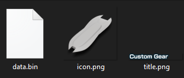

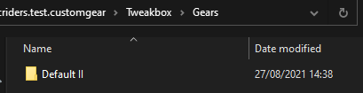

Make sure your mod is enabled in Reloaded and restart the game.

### 6. Update the Gear

After restarting, your gear should show up in the `Gear Editor`.

If you need to make any further changes to the gear, perform them via the Gear Editor and then press the `Update Custom Gear Data` button.

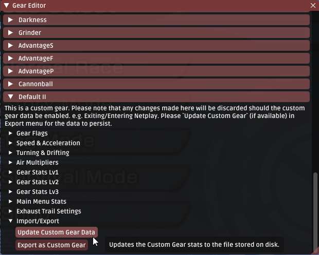