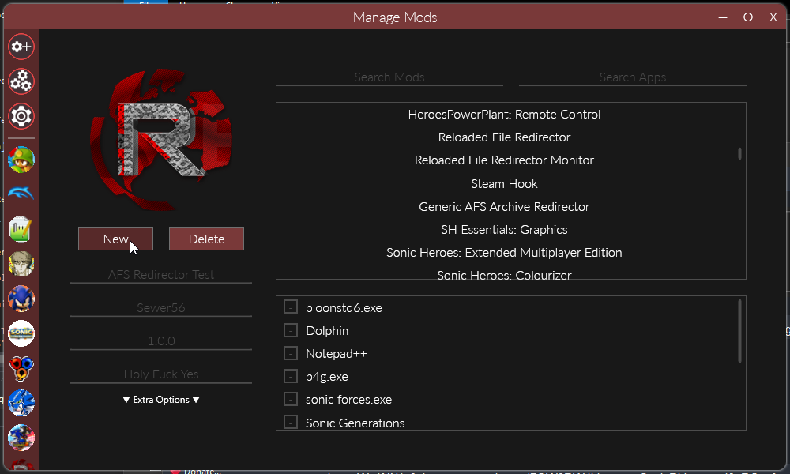
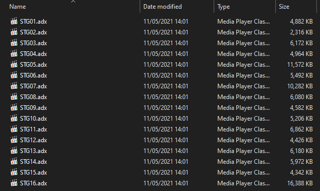

# Adding Music

Riders.Tweakbox allows you to add ADX music to the game to provide alternative tracks to the game's default soundtrack. 

When the game is about to play a music track, Tweakbox will randomly choose from a collection of vanilla tracks + all of the user provided tracks.

Don't know how to create an ADX track? Google it!

## Getting Started

You can add/replace music by creating Reloaded II mods.

This is a short summary of how to create a mod; for a more in-depth guide on creating mods, please refer to the [Reloaded-II documentation](https://reloaded-project.github.io/Reloaded-II/GettingStartedMods/).

### 1. Make a new Mod

### 2. Enable it for Sonic Riders

And go to your mod directory.

### 3. Create the Music Directory

Inside mod directory, create a folder called `Tweakbox` and inside it, a folder called `Music`.

### 4. Add the Music

Tweakbox detects newly added music in real time. If you add a track, it will become a candidate to be played next time.

## Replacement Modes

Tweakbox supports two modes of music replacement:
- Per File
- Per Stage

### Per File

In this mode, if you add a file with name equivalent to a vanilla track; it will (randomly) replace the vanilla track.

### Per Stage

In this mode, you can add a music track to be (randomly) played on a specific stage.

To use this mode, name your music file `STGXX` where `XX` represents the index of the track, for example:

- 00 = Metal City 
- 01 = Splash Canyon
- 09 = Night Chase

## Multiple Music Tracks

If you have multiple music tracks which you wish to include to replace a single track, put them in separate folders:

In this example, each of the folders has a file called `S20.adx` inside.  
In this example, we add 16 menu themes to the game.