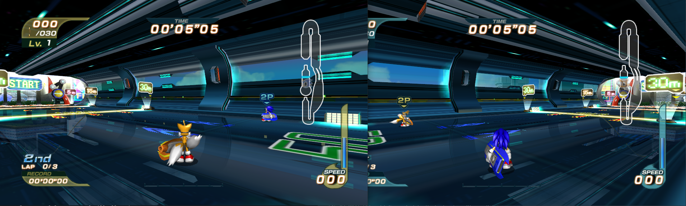

# Features

✔ Fully Implemented & Reliably Working  
⚠ Work in Progress / Has Issues  
❌ Not Yet Implemented  
💢 Not Yet Implemented (Low Priority)

## 🌍 Netplay / Online Multiplayer

At the current moment in time, Netplay works in the following manner:

- Host enters Free Race/Grand Prix/Tag/Battle Mode.
- Host presses `Host` in Track Select Mode, waits for everyone to connect.
- Client enters same mode as host (Free Race/Grand Prix/Tag/Battle Mode).
- Client connects to the host by entering their IP & Port combination. 
- Host and Client select stage & characters together.
- After race finishes, Host and Client manually go back to stage select.

If you don't know the host's IP, ask the host to use a website such as [WhatIsMyIp](https://whatismyip.host).  
You're interested in IPv4.

### 🚀 General Features
✔ Single-Screen Mode  
✔ Split-Screen Mode  
✔ Spectator Mode  
✔ Multiplayer Online  
✔ Custom Jitter Buffer (Reduced Player Stuttering)  
✔ NAT Punching (No Port Forwarding Required)  
💢 Custom Game Modes (Relay, Hide & Seek)

### 💫 Menu Synchronization
✔ Stage Select Menu  
✔ Character Select Menu  
✔ Race Settings Menu  
❌ Return Straight to Stage Select Post Race  
❌ Disconnect Clients Leaving Stage Select Post Race  

### 💥 In-Race
✔ Accurate Physics (Speed, Rotation, Position, Turning, AnalogInput)  
✔ Accurate Attacks (Client-Side)  
✔ Accurate Race Start Time (~1 frame difference)  
✔ Player State  
✔ Game Data (Custom Gears/Physics)  
✔ Lap Counter  
✔ Race Finish Time  
✔ Skip Intro Cutscene  
✔ Control Player Post Race Finish (It's Funny!)  

⚠ Random Number Generator\*  
⚠ Separate Item Random Number Generator\*\*  

❌ Pauseless Pause Menu  
❌ Post-Race Pause/Results Menu Synchronization  
❌ Ramp/Trick Synchronization  
💢 Player Indicators in Split Screen  
💢 Player Indicators for 5P/6P/7P/8P  
💢 Lap Timer Synchronization  
💢 Battle Mode Spawn Synchronization  
💢 Battle Mode Health Synchronization  
💢 Movement Extrapolation (Roll-forward/Real-time prediction of player position)

\* Desyncs in single-screen mode due to off-screen objects seeding RNG.  
\*\* Can desync on extremely unstable connections.

### 🛑 Anti-Cheat
An optional feature for when things become more stable...

💢 Anti Lap Counter Manipulation  
💢 Anti Ring Counter Manipulation  
💢 Anti Teleport  
💢 Anti Gear & Physics Data Manipulation  
💢 Anti Speed Hack  
💢 Anti RNG Unrandomizer

## ✨ Graphics
✔ Use Direct3D 9Ex Renderer (better fullscreen, performance gains)  
✔ Fixed Performance Issues on Multi-core Systems  
✔ Fixed Frame Pacing (no more micro-stutters)  
✔ Borderless Windowed  
✔ Custom Resolution  
✔ Toggle Blur  
⚠ Dynamic Widescreen Hack\*  

\*  WIP, Suggest using GameMasterPlc's Widescreen EXE in the Meantime.

## ⚙️ Editors
✔ Gear Editor  
✔ Physics Editor  
- ✔ Running Physics  
- ✔ Character Type Stats

## 🎮 Gameplay
✔ Simulate Keyboard QTE Bug  
✔ Force Single Player Stages  
✔ Force Single Player Models

## 🌌 Miscellaneous
✔ Boot to Menu  
✔ Unlock All  
✔ Import Gear Data from Dolphin Emulator (GameCube Version)  
✔ Various Debug Tools