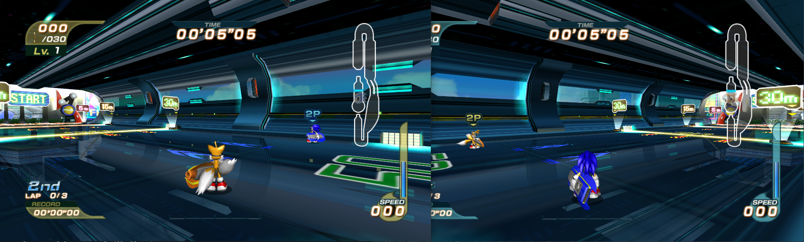
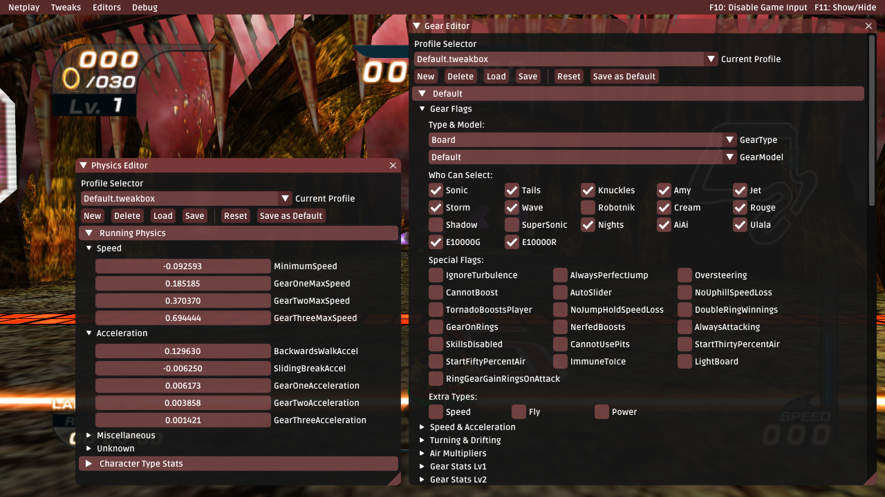

	<h1>Tweakbox for Sonic Riders</h1>
	 
	<strong>⛸ Catch me if you can 🛹</strong>
    
All in one mod for Sonic Riders PC.

Also commonly known as the "Netplay Mod", Tweakbox is an all in one [Reloaded II](https://reloaded-project.github.io/Reloaded-II/) mod for Sonic Riders which adds various pieces of functionality to the PC version of Sonic Riders.

This project is currently a "work in progress"; while it is usable/playable, this project is not yet "ready for public consumption" at this moment in time. Tread at your own risk. 

## Samples

	 
    
*Online Mutliplayer*

	 
    
*Gear & Physics Editing*

