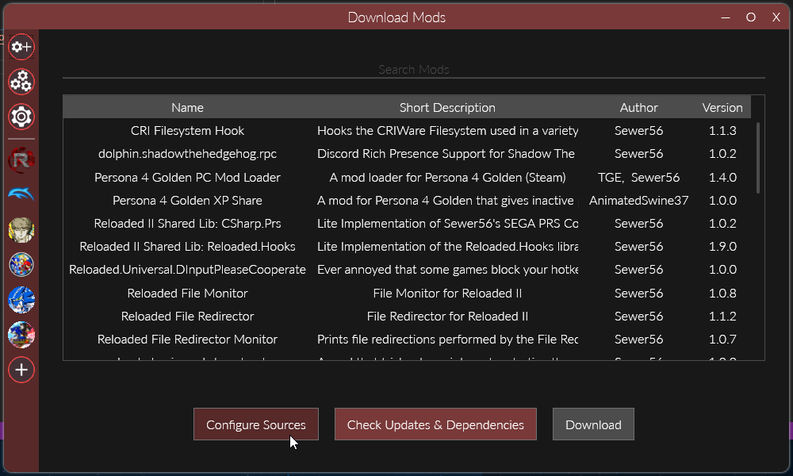
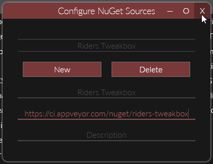

# Installation

------------
Please do not ask for Tech Support (e.g. *"How do I use this mod"*). The mod is incomplete, buggy and still a work in progress; it is not yet in a state I consider acceptable for normal end users. Thank you.

------------

Given the current state of the project, binaries are not currently available for regular users.

However, if you are interested in trying out the mod, you can install it (and receive updates) by using the following method below.

## Instructions

- Add the feed `https://ci.appveyor.com/nuget/riders-tweakbox` to your sources in Reloaded's `Download Mods` menu.

- Download the mod from the menu.

*PLEASE report any bugs/inconsistencies/crashes as soon as you encounter them using the guidelines listed in [reporting-issues](reporting-issues.md)*.
