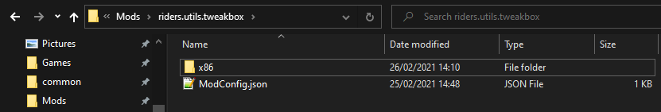

# Installation

------------
*Please do not ask for Tech Support* (e.g. *"How do I use this mod"*). The mod is incomplete, buggy and still a work in progress; it is not yet in a state I consider acceptable for normal end users. Thank you.

------------

## Prerequisites
- [Reloaded-II](https://github.com/Reloaded-Project/Reloaded-II/releases). ([Quick Start](https://reloaded-project.github.io/Reloaded-II/QuickStart/))
- Unmodified Copy of PC Riders

## Recommendations 
- [GameMaster's 16:9 EXE](https://www.wsgf.org/f/u/contrib/dr/658/hacks/riders169.7z) 
  - Optional: Use either this or Tweakbox' (incomplete) widescreen hack. Resolution can be overwritten inside Tweakbox.

## Instructions
This is a Reloaded-II mod.  
If you are unfamiliar with Reloaded-II, consider looking [here](https://reloaded-project.github.io/Reloaded-II/).

- Download `Riders.Tweakbox.zip`.
- Navigate to the `Mods` folder inside your Reloaded folder.
- Create a folder called `riders.utils.tweakbox`.
- Extract the contents of the zip to the folder you just created.
- Enable inside the Reloaded-II launcher.

*PLEASE report any bugs/inconsistencies/crashes as soon as you encounter them using the guidelines listed in [reporting-issues](reporting-issues.md)*.