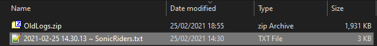
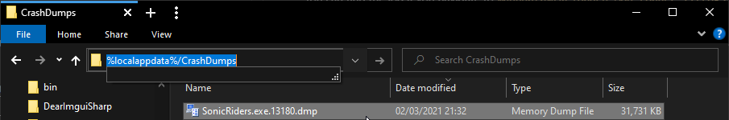

# Reporting Issues

I am currently interested in:  
- Netplay Crashes  
- Misc. Bugs

## What to Include (Crash Reports)

When submitting a crash report, you should include the following:

---------

- **Reloaded Console Log**

You can find the log if you navigate to `%appdata%/Reloaded-Mod-Loader-II/Logs` inside explorer.

Sort by "Date Modified" and grab the latest log.

---------

- **Crash Dump**

Open Windows Explorer and navigate to `%localappdata%/CrashDumps`.

Sort by "date modified" and copy the latest dump with `SonicRiders.exe` in the name.

---------

If you are recording your gameplay, the moment of the crash would also be greatly appreciated.

## Where to Report Issues?

Preferably if possible, please report issues to [GitHub Issues](https://github.com/Sewer56/Riders.Tweakbox/issues).

Alternatively, you can contact me in the [Extreme Gear Labs Discord Channel](https://discord.gg/tRHFnNgFta); use any channel of you liking.