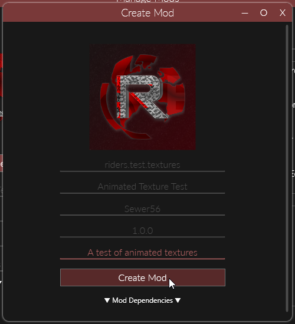
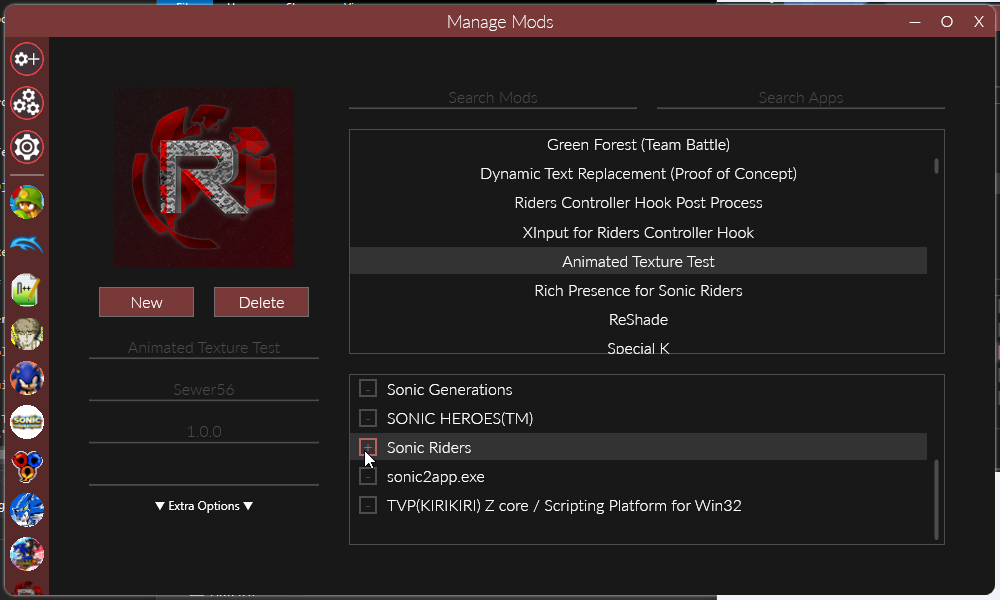
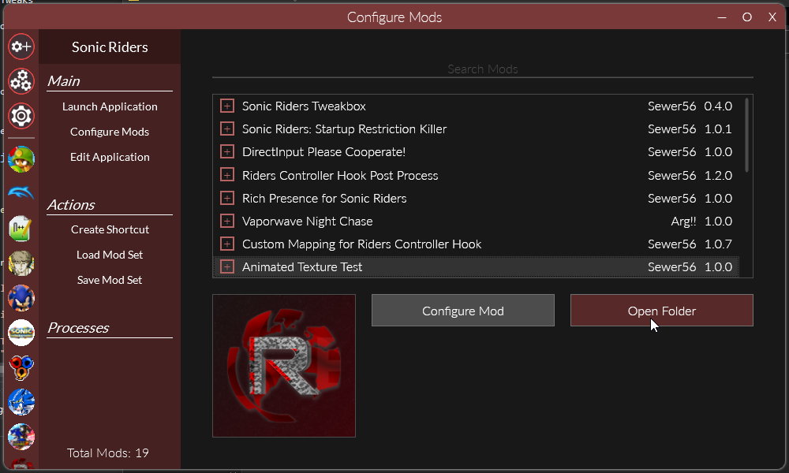

# Adding Textures

Riders.Tweakbox allows you to replace textures in real-time by hijacking function calls to the Direct3D 9 API.

## Creating a Texture Pack

You can add/replace textures by creating Reloaded II mods.

This is a short summary of how to create a mod; for a more in-depth guide on creating mods, please refer to the [Reloaded-II documentation](https://reloaded-project.github.io/Reloaded-II/GettingStartedMods/).

### 1. Make a new Mod

### 2. Enable it for Sonic Riders

And go to your mod directory.

### 3. Create the Texture Directory

Inside mod directory, create a folder called `Tweakbox` and inside it, a folder called `Textures`.

### 4. Add the Textures

Add textures in one of the supported formats.

Tweakbox detects newly added textures in real time; however cannot force Reload them. In other words, if you add a stage texture you will have to exit and re-enter the stage before the new texture takes effect.

### Where do I get the Textures?

The easiest way to get a hold of the stock textures is to use a known dumped texture set, such as the [Community Sonic Riders Texture Library](https://drive.google.com/drive/folders/17ZLnShFn7p20Pv7D0HfGdEi58hgkFjyO). 
(Has ~99% of the textures, neatly categorized).

Alternatively, you can dump them yourself from inside Tweakbox, if you visit the DirectX Texture Injection menu from Tweakbox.

## Supported Formats

- PNG
- DDS
- DDS.LZ4

In the case of DDS, there is no restriction on internal format; as long as DirectX supports it.

In the case of DDS.LZ4; it is a custom variant of DDS compressed with the LZ4 compression algorithm exported by my [texture optimisation tool](https://github.com/Sewer56/DolphinImageOptimizer).